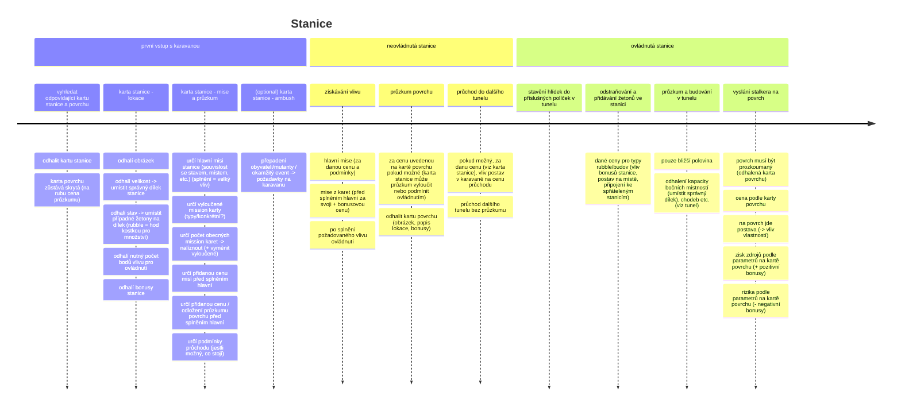
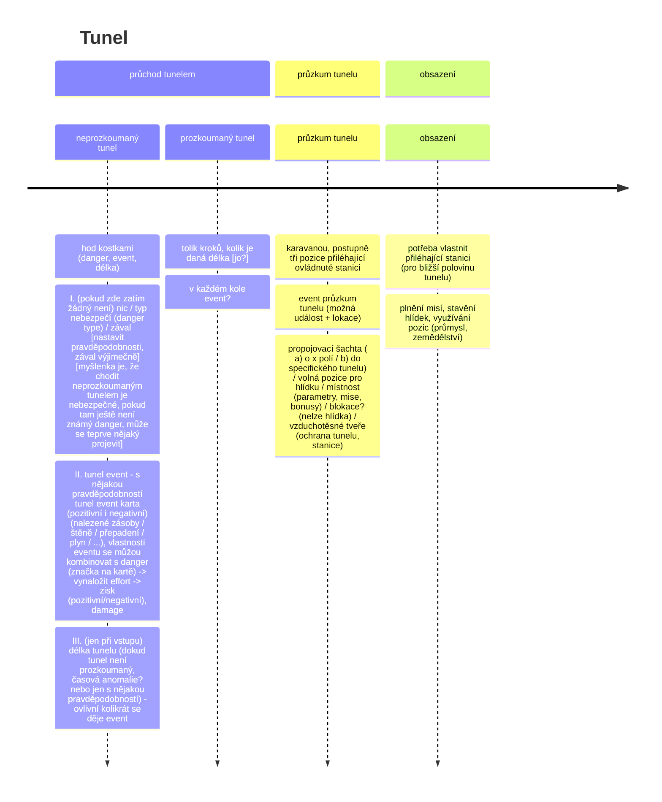
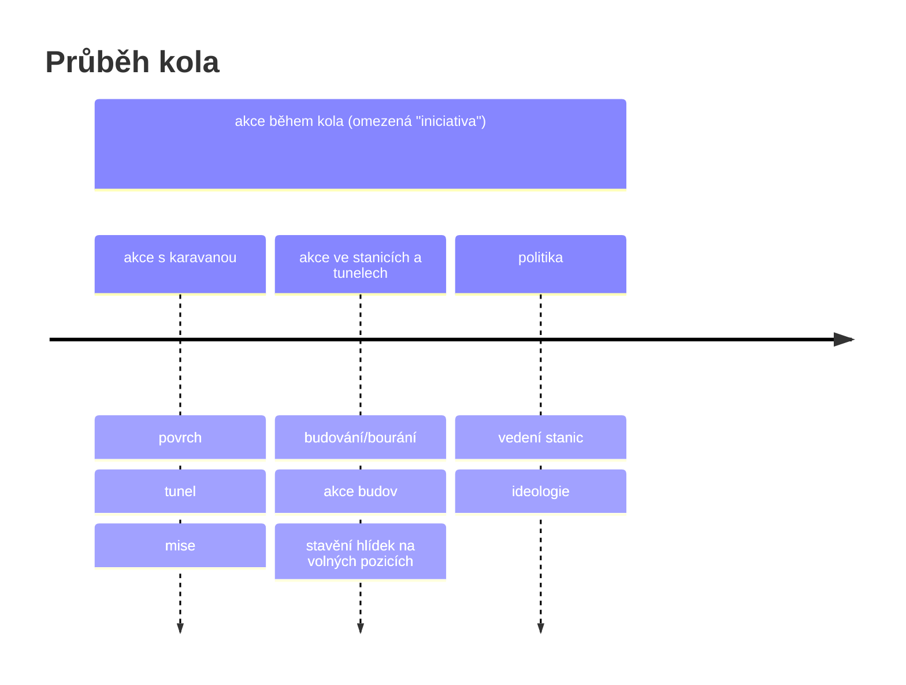
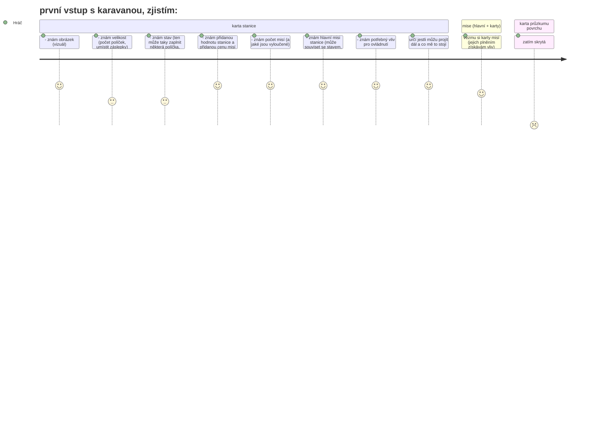
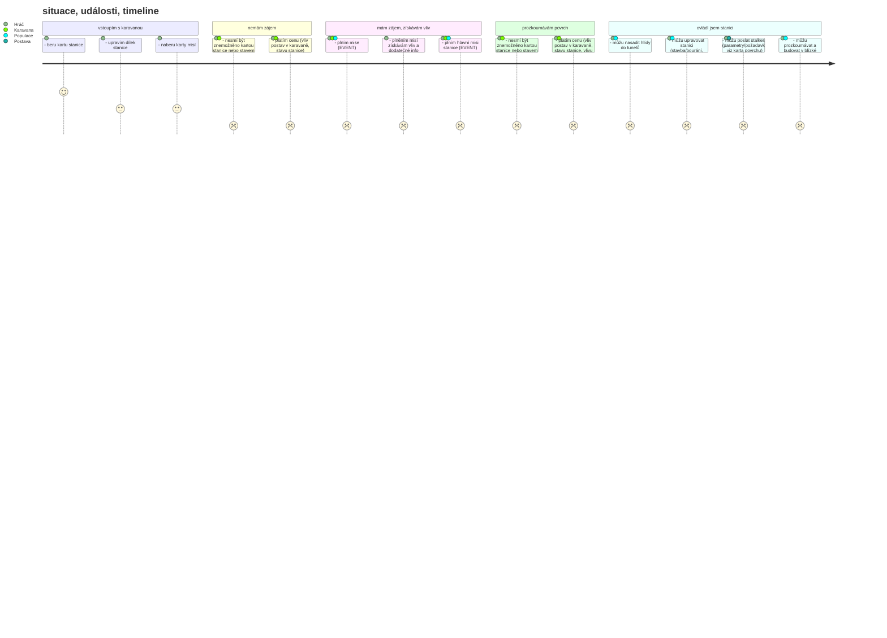

# METRO 20XX - Stolní hra založená na METRU 2033-2035

note - [] = poznámka k diskuzi

# Lidi
## Postavy
* potřeba k sestavení karavany (ta má default velikost, větší za příplatek)
* classy
    * mají specifické schopnosti
        * -> vliv na eventy
        * -> + speciální, specifické (odborník na něco) [např. někdo by mohl na povrch v neovládnuté stanici?]
* verbování v hospodě + při zisku jednotky [=třeba 10 lidí] populace stanice
    * stalker - původní povolání/specializace neguje negativní vliv (bonus) lokace
    * voják/bojovník
    * inženýr/technik
    * zemědělec
    * zdravotník
    * kuchař
    * zaměstanec metra
    * obchodník
    * sensibil

## Populace
* počet v jednotkách [třeba po desítkách lidí]
* množstvím populace podmíněné některé budovy, aktivity?, hlídky, karavany, zaměstnání
* může už být v objevené stanici - získání ovládnutím
* potřebuje jídlo podle množství jednotek
* vzniká zvýšením kapacity ubytování + podmínění blahobytem?, jídlem?
* zaniká eventy? při ztrátě se zničí/degraduje ubytování podle množství

## Karavany
* sestavení z postav
* defaultní počet = ?
* účely
    * průzkum tunelu/stanice
    * mise ve stananici/tunelu
    * průzkum povrchu
    * lootění povrchu (potom cooldown)
    * transport zboží

# Budovy
* úrovně zlepšují parametry, budou pro ně stříbrné a zlaté rámečky
* některé dvoupatrové? (sklad)
* provázání funkcí a bonusů? (zaměření stanice - vojenská/hospodářská/tržní)
## Ubytování
* úrovně (stany, domky, zazděné průchody)
* generuje populaci
## Hospodářství
* živočisné / rostlinné
* generuje jídlo
* upgrade materiálem, lidmi, okolnostmi (bonusy) stanice/tunelu
## Dílny
* specializace -> nižší cena
* konzervárna, zbrojnice, výroba ochranného materiálu
## Generátor
* tři úrovně
    * basic - spotřebovává víc pracovní síly
    * vyšší - spotřebovává víc materiálu
    * speciální - podmíněná okolnostmi (bonusy) stanice (řeka/vítr/reaktor), menší spotřeba
* ovlivňuje blahobyt, počet stanů -> populace
* stojí materiál a pracovní sílu
# Vodárna
* úrovně (+ specifické rozšíření s řekou, rezervoarem atd)
* ovlivňuje blahobyt, počet stanů -> populace
* stojí materiál a pracovní sílu
# Medik
* přidává blahobty
* bonus pro stalkera (snížení negativního vlivu)
* bonus při bojích?
# Hospoda
* přidává blahobyt
* možnost směny zboží
* verbování postav
# Trh
* přidává blahobyt
* možnost směny zboží
* vyžaduje spřátelené stanice v okolí
# Knihovna
* blahobyt
# Modlitebna
# Sklad
* menší spotřeba materiálu?
# Kuchyň
* znásobí jídlo získané z hospodářství
# Základna stalkerů
* zmenšuje/nuluje cooldown výstupů
* bonusy pro stalkery?

# Bonusy
* i negativní
* u čeho se projevují a na co mají vliv
## Stanice
* voda (řeka / rezervoar)
    * ++ zdroj vody
    * ++ zdroj energie
    * -- riziko zatopení
* vítr na povrchu
    * ++ zdroj energie
    * -- rizikový výstup?
* povrch
    * farma / veletrh / les - bonus pro hospodářství
        * ++ semena / sazenice speciálních rostlin (lysohlávky, čaj, ...)
        * -- nebezpečí živočichů
    * armádní objekt - bonus pro dílny, základnu
        * ++ vždy přinesou náboj(e) (loot = bereš X karet, zbraň ber + suroviny)
        * ++ šance na extra zbraně / výbušniny / výstroj?
        * -- riziko výbuchu
        * -- riziko nepřátel (banditů)
    * stavebniny / staveniště
        * ++ materiál
        * -- riziko pádu
    * obchoďák
        * ++ jídlo, oblečení, civilní vybavení, gadgets
        * -- banditi / nepřátelé / živočichové
    * nádraží / depo - bonus pro dílny
        * ++ strojní materiál
        * ++ bonus pro transport, levnější drezína
        * -- banditi
    * klidné sousedství
        * žádný bonus, žádné hrozby
    * hnízdo mutentů
        * -- riziko
* stavba stanice + vestavěné featury
    * oblouky
        * ++ levnější vyšší úroveň ubytování
        * -- menší kapacita
    * plocha
        * ++ větší kapacita
        * -- náročnější na energii (až 2. úroveň generátoru dává bonusy etc.)
    * přestupní
        * ++ mega kapacita
        * -- těžší ovládnutí (mise)
    * nemocnice
        * ++ levný medik
    * generátor
        * ++ generátor začíná na 2. lvl (ale potřeba splnit požadavky)
    * vodárna
        * ++ rovnou 2. lvl včetně požadavků
    * sklady
        * ++ materiál
        * ++ prostor
## Tunel
* teplo
    * ++ zemědělství
    * -- obyvatelnost
* vítr
    * ++ zdroj energie
    * -- obyvatelnost / hospodářství
* stavba
    * -- nefunkční ventilace - zamoření, potřeba spravit/zničit
* sektářský vlak / opuštěná souprava
* tlakové dveře
    * potřeba 2. lvl generátor k používání
    * ochrana před danger v tunelu, nepřátelským sousedem

# OLD
# TODO: 
pojmenování pro vliv

# komponenty a mechaniky

