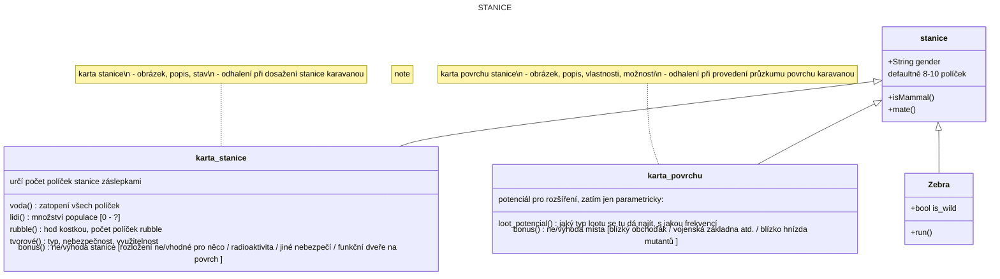
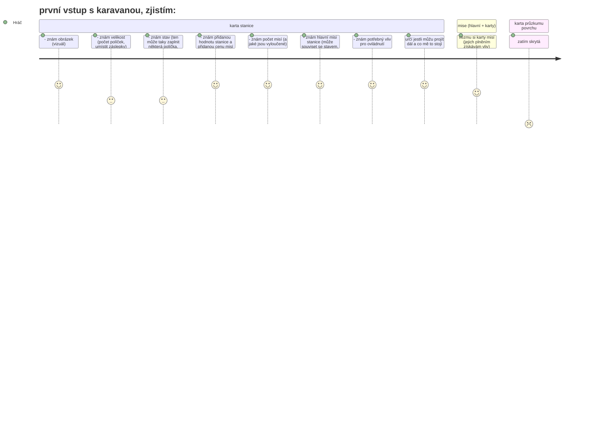
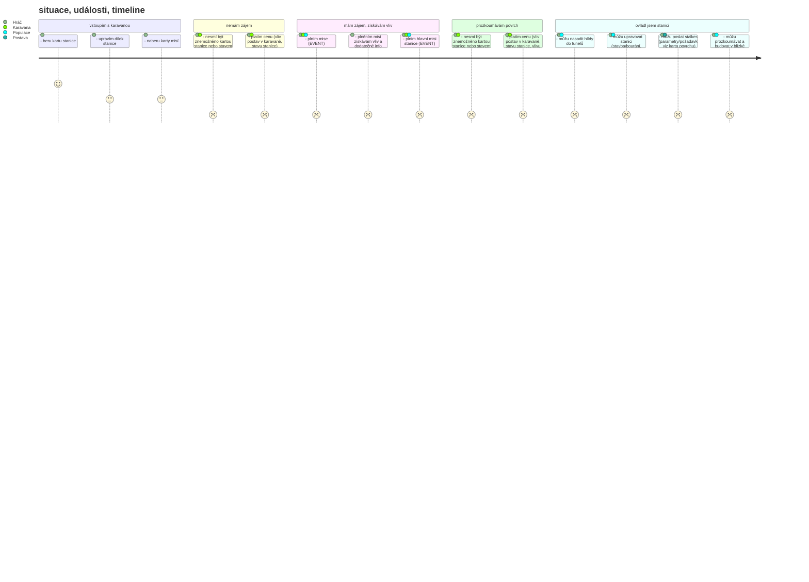

# METRO 20XX - Stolní hra založená na METRU 2033-2035

# TODO: 
pojmenování pro vliv

# komponenty a mechaniky

```mermaid
---
title: STANICE
---
classDiagram
    note "note"

    stanice <|-- karta_stanice
    note for karta_stanice "karta stanice\n - obrázek, popis, stav\n - odhalení při dosažení stanice karavanou"

    stanice <|-- karta_povrchu
    note for karta_povrchu "karta povrchu stanice\n - obrázek, popis, vlastnosti, možnosti\n - odhalení při provedení průzkumu povrchu karavanou"

    stanice <|-- Zebra
    stanice : +String gender
    stanice : defaultně 8-10 políček
    stanice: +isMammal()
    stanice: +mate()


    class karta_stanice{
        určí počet políček stanice záslepkami
        voda() zatopení všech políček
        lidi() množství populace [0 - ?]
        rubble() hod kostkou, počet políček rubble
        tvorové() typ, nebezpečnost, využitelnost
        bonus() ne/výhoda stanice [rozložení ne/vhodné pro něco / radioaktivita / jiné nebezpečí / funkční dveře na povrch ]
    }

    class karta_povrchu{
        potenciál pro rozšíření, zatím jen parametricky:
        loot_potencial() jaký typ lootu se tu dá najít, s jakou frekvencí
        bonus() ne/výhoda místa [blízký obchoďák / vojenská základna atd. / blízko hnízda mutantů ]
    }

    class Zebra{
        +bool is_wild
        +run()
    }
```

```mermaid
---
note: entity a složitosti
---
journey
    title první vstup s karavanou, zjistím:
    section karta stanice
      - znám obrázek (vizuál): 5: Hráč
      - znám velikost (počet políček, umístit záslepky): 3: Hráč
      - znám stav (ten může taky zaplnit některá políčka, omezit výběr misí): 3: Hráč
      - znám přidanou hodnotu stanice a přidanou cenu misí ve stanici (do splnění hlavní mise): 5: Hráč
      
      - znám počet misí (a jaké jsou vyloučené): 5: Hráč      
      - znám hlavní misi stanice (může souviset se stavem, přidanou hodnotou) (splnění dá hodně vlivu, není nutné): 5: Hráč
      - znám potřebný vliv pro ovládnutí: 5: Hráč

      určí jestli můžu projít dál a co mě to stojí: 5: Hráč # TODO: tady? nebo random?
    section mise (hlavní + karty)
        vezmu si karty misí (jejich plněním získávám vliv): 4: Hráč
    section karta průzkumu povrchu
        zatím skrytá: 0: Hráč

```

```mermaid
---
note: entity a složitosti
---
journey
    title situace, události, timeline
    section vstoupím s karavanou
      - beru kartu stanice: 5: Hráč
      - upravím dílek stanice: 3: Hráč
      - naberu karty misí: 3: Hráč
    section nemám zájem
      - nesmí být znemožněno kartou stanice nebo stavem: 1: Hráč, Karavana
      - platím cenu (vliv postav v karavaně, stavu stanice): 1: Hráč, Karavana
    section mám zájem, získávám vliv
      - plním mise (EVENT): 1: Hráč, Karavana, Populace
      - plněním misí získávám vliv a dodatečné info (random karta) - buff pro mne a stanici: 1: Hráč
      - plním hlavní misi stanice (EVENT): 1: Hráč, Karavana, Populace
    section prozkoumávám povrch
      - nesmí být znemožněno kartou stanice nebo stavem: 1: Hráč, Karavana
      - platím cenu (vliv postav v karavaně, stavu stanice, vlivu na stanici???) -> odhalení karty povrchu (EVENT): 1: Hráč, Karavana
    section ovládl jsem stanici
      - můžu nasadit hlídy do tunelů: 1: Hráč, Populace
      - můžu upravovat stanici (stavba/bourání, žetony): 1: Hráč, Populace
      - můžu poslat stalkera (parametry/požadavky viz karta povrchu): 1: Hráč, Postava
      - můžu prozkoumávat a budovat v blízké polovině tunelu (odhalit kapacitu bočních chodeb, zaslepit zbytek - hod kostkou): 1: Hráč, Populace

```